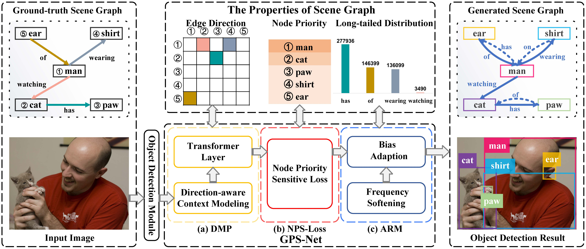

# GPS-Net
[](https://github.com/taksau/GPS-Net/blob/master/LICENSE)
[](https://www.python.org/)
 


This repository contains data and code for the paper [GPS-Net: Graph Property Sensing Network for Scene Graph Generation (CVPR 2020)](https://arxiv.org/pdf/2003.12962).


<div style="color:#0000FF" align="center">

</div>

If the paper significantly inspires you, we request that you cite our work:
### Bibtex
```
@misc{lin2020gpsnet,
    title={GPS-Net: Graph Property Sensing Network for Scene Graph Generation},
    author={Xin Lin and Changxing Ding and Jinquan Zeng and Dacheng Tao},
    year={2020},
    eprint={2003.12962},
    archivePrefix={arXiv},
    primaryClass={cs.CV}
}
```

Our reimplementations are based on [rowanz/neural-motifs](https://github.com/rowanz/neural-motifs), and if you get any problem that cause you unable to run the project, you can check the issues under [rowanz/neural-motifs](https://github.com/rowanz/neural-motifs) first.

**The Completed code is coming soon.**
But we have released some codes of **DMP Modules**, **NPS-Loss** and **Frequency Softening**. And you can see the codes in [lib](https://github.com/taksau/GPS-Net/tree/master/lib).

## Demo Video
[Scene Graph Generation for Cityscape Video](https://www.youtube.com/watch?v=9ZJXiXCIqxc)

[Scene Graph Generation for Fruit Video](https://www.youtube.com/watch?v=fLfR_TCrm-w)

[Scene Graph Generation for CCTV Video](https://www.youtube.com/watch?v=0gYRgxEp7Z0)


## Reported Results

|         | R@20 | R@50 | R@100 |
|---------|------|------|-------|
| SGGen   | 22.6 | 28.4 | 31.7  |
| SGCls   | 36.1 | 39.2 | 40.1  |
| PredCls | 60.7 | 66.9 | 68.8  |
